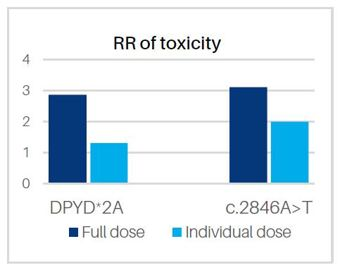

# Reproducibility and Failing loudly - handling error in clinical screening

#### By Evelyn Collen


## **1. Introduction**

### What happens when we can't afford to fail - DPYD pharmacogenomic screening 


In last week's practical, we started to get the hang of handling failing scripts and the concept of failure in general. Here we are going to focus on how we can best handle errors in diagnostic reporting. 

The DPYD gene is responsible for generating the dihydropyrimidine dehydrogenase (DPD) enzyme, which plays a key role in the metabolism of toxic compounds. Deficiency in this enzyme can cause fatal toxicity to fluoropyrimidine chemotherapy treatments (e.g., 5-fluorouracil, capecitabine), which are widely used in the treatment of solid tumours such as colorectal cancer, breast cancer and gastrointestinal cancers. Variants in the DPYD can cause different functionality in the DPD enzyme's function, categorised into zero, decreased, or normal function. 

Getting the variant-tailored dosage just right is absolutely crucial, as the standard dose that is effective for some people can be fatal for certain variant carriers. Severe toxicity to these drugs occurs in about 10% to 40% of patients, and around 7% of Europeans carry some variant that impairs function. In South Australia, there has unfortunately been a recorded case of patient fatality due to DPD enzyme deficiency and an incorrectly tailored dosage. 




Figure 1. The relative risk of toxicity in those with versus without the
specified variant when treated with full or individualised dose (taken from [Sonic Genetics](https://www.sonicgenetics.com.au/))
 
 
Depending on the configuration of alleles, and whether those alleles have zero, decreased or normal function, patients will receive a metabolism rating. Have a look at how the rating is worked out in this [DPYD metabolism rating table](images_and_refs/DPYD_metabolism_rating_and_recommendations.xlsx)


In this scenario, you are a clinical bioinformatician tasked with finding out whether four cancer patients are carrying particular variants in a DPYD gene, and what phenotype and metabolism rating can be deduced from their allele types. It's absolutely critical we get this right in the end, as the oncologist will use this information to determine the best course of treatment that can aggressively handle the cancer, whilst minimising the effect on the patient as much as possible. 
The patient is waiting on this information - so not only we have to get it right, we want do it quickly. Last week we made sure our errors were noisy in our scripting; this week we are going to make our pipeline noisy about the whole process. 

### 1.1 Reminder about virtual Machines

As usual we will be connecting the virtual machines, 

**Please [go here](../../Course_materials/vm_login_instructions.md) for instructions on connecting to your VM.**

## 1.2 Learning Outcomes

1. Understand clinical failure in a clinical bioinformatics and how to minimise it
2. Learn ways to minimise failure in 
4. 


## 1.3 About the dataset

rhampseq

Today we are looking at four patients, who I have anonymised to Patient A, Patient B, Patient C and Patient D. These patients have had real diagnostic reports issued out for them, and you can have a look at the anonymised versions here. [DPYD patient reports](images_and_refs/DPYD_metabolism_rating_and_recommendations.xlsx)


**Questions:**
1.  Referring to the DPYD metabolism table, what score would be given to patient who has 1 normal funtion allele and 1 decreased function? Would you classify their phenotype as normal, intermediate or poor?
2. Referring to the DYPD patient reports, which patient actually has 2 decreased function alleles that are both classified as poor metabolisers? If you had to guess, what dosage would likely be given to this patient?

3. Would it be a good idea to deduplicate rhampseq amplicon data? Why or why not? 
 
<details>
<summary>Answers</summary>
<ul><li>1. Intermediate metaboliser </li>
<ul><li>1. Probably a minimum dosage or a  </li>
<li>3. It wouldn't be a good idea because ampicon data typically doesn't have UMIs, and all the read fragments are stacked on top of each other - so if you deduplicate, you will lose all your reads. </li> </ul>
</details>


## **2. Errors with sample integrity**

### 2.1 Getting scripts and data ready

load software
```bash
source activate bioinf
```

create all directories and move into project directory
```bash
mkdir -p ~/Practical_Failing_Loudly/{0_scripts,1_vcfs,2_bam,3_reports,4_refs}
cd ~/Practical_Failing_Loudly
```

copy scripts and data and also make symlinks

```bash
cp ~/data/failing_loudly/0_scripts/* 0_scripts/
ln -s ~/data/failing_loudly/*.vcf 1_vcfs/
ln -s ~/data/failing_loudly/*.bam 2_bam/
ln -s ~/data/failing_loudly/4_refs/* 4_refs/*
```

### 2.2 Checking a sample's integrity with genetic fingerprinting

The throughput of NGS samples going through clinical laboratories around Australia is really high, and getting higher every year. Some labs are seeing more than 20,000 NGS samples processed each year. This is pushing a lot of automation both in lab and in silico, but even now some lab steps are manual. With so many samples being manually handled at certain steps, how can we guarantee that no sample has been swapped or contaminated with another? 

One way is to separate the sample into two, right at the beginning when the lab first receives the sample. The first part of the sample goes through the normal testing process, and we generate data for it. The second part goes through a completely independent workflow, where we target just a handful of common SNPs.


CHANGME diagram of sid testing


There are quite a lot of other sanity checks we can do from the bioinformatics side, including checking the population ancestry of the sample and the pedigree of the sample in the case of families, and that all members of the family are genetically related to each other as expected.

Let's start by running a fingerprint check for Patient A. 


**Questions:**
1.  I haven't mentioned one really common sanity check to interrogate sample integrity. Can you guess what it is? Hint: what's something obvious you can tell from a patient's genetic makeup? 
2. What would happen to the LOD score if the sample swap occured *prior* to the lab receiving the sample? 

<details>
<summary>Answers</summary>
<ul><li>1. Doing a sex check to see that the genetic sex matches expected patient sex </li>
<li>2. The LOD score would still be positive, as the counterpart sample would have all the same genotypes as the main sample, seeing as the swap occured prior to the counterpart sample being split off. </li> </ul>
</details>


match vcfs with gatk fingerprint


**Questions:**
1.  

<details>
<summary>Answers</summary>
<ul><li>1. </li>
<li>2.  </li> </ul>
</details>


### 2.2 Checking for any evidence of contamination


High number of SNPs at low vaf 

#filter 

```bash
bcftools filter -i 'DP>10 && QUAL>30' file.vcf
```


## Is the variant correctly called?


No variant caller is perfect, and even the biggest and more robust programs can make mistakes. Take a look at this GATK Haplotype Caller issue page for incorrectly called variants:

use bcftools to check the variant call 

give link to gatk calling bugs (high amplicon reads)


## Running Quality Control and outputting pass or fail 


## What happens if things go wrong in the pipeline?


Remember last week when we actively broke some python scripts? You may remember the error message from the validator script was relatively straightforward. What will happen if we run a dodgy vcf through our mini pipeline script? Let's give it a try. 

```bash
cp ~/data/failing_loudly/patient_1_dodgy.vcfs 1_vcfs/


## 


## Generating the report 
 


#Generates summary statistics
bcftools stats file.vcf


match patient to report 


## Final boss: be skeptical of ChatGPT and AI friends


# Bonus tasks if time permitting 
1. Take a look at our bash script. "DPYD_mini_pipeline.sh". In that bash scripts, are the paths to the python and awk scripts absolute or relative? Could this cause issues? Can you change the path to be absolute instead? (hint: to get the path of a script or file, you could run):

```bash
 ls -d "$PWD"/{script_or_file_name} )
```

2. In the reports, the following caveat is given: "For the HapB3 genotype “decreased function” is inferred by detecting the exonic tag SNP (c.1236G>A). Recent studies indicate that in rare cases, the causal decreased function variant c.1129-5923C>G may not be present despite having this tag SNP". What mechanism could cause the causal variant not be present in a patient, when the tag SNP itself is?


## Concluding remarks

Hopefully through doing this prac, you will see that even when the stakes for not failing are high, by being loud about everything that could go wrong in as many key places we could, we can assure our clinicians and our patients that everything that the reports have been painstakingly checked and are accurate to the best of our ability. Perhaps the old adage is true, and failing loud really is the key to success! 